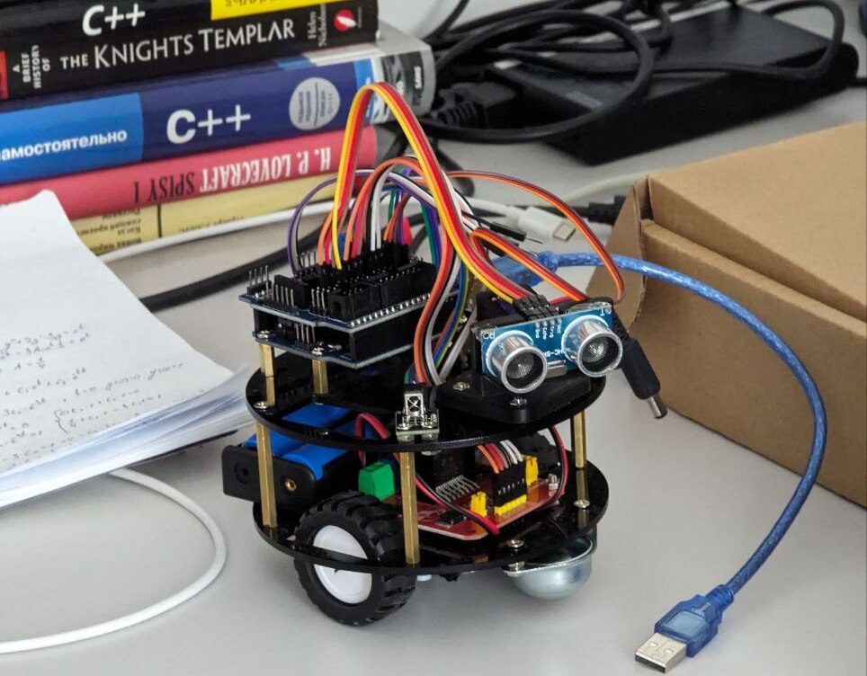

# PathFinder-Mini-Arduino

## Description:

The "PathFinder Mini" is an intricate Arduino-based robot tailored for adept obstacle avoidance and managed via IR remote control. It comes outfitted with HC-SR04 ultrasonic sensors for high-precision detection within its vicinity. These sensors enable the "PathFinder Mini" to survey the environment and independently strategize navigation around impediments, making it perfect for automated movement systems.

## Robot:
The robot includes an IR receiver, granting users the power to toggle between automated and hands-on control with a standard IR remote. This versatility ensures enhanced control over the robot's trajectory in diverse settings.

## Project
The project also features a KY-033 line sensor, repurposed here as a "ground" detector, which confirms that the robot is operating on a solid surface. This is particularly advantageous for verifying the robot's stability throughout its journey.

Motors within the robot are directed through an L293D motor driver, delivering essential command and vigor for motion instructions. Supported by Arduino and a specialized shield, the programming structure facilitates straightforward adaptation or augmentation of the "PathFinder Mini's" capabilities to suit specific requirements or for educational purposes.
